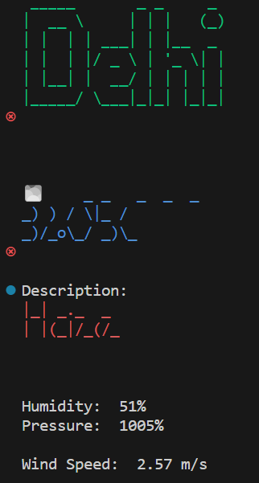

# Weather Forecast CLI Tool

This command-line tool creates a weather forecasting tool using Python, sys.argv, pyfiglet, and the OpenWeatherMap API. We demonstrate GitHub Copilot's support for API use, data parsing, and error handling by using it. The city name can be retrieved with the use of sys.argv, and pyfiglet creates ASCII graphics for the city's name to improve the aesthetics. We effectively retrieve weather data, parse it for pertinent information, and deal with potential mistakes with Copilot's help. This solution exemplifies how GitHub Copilot enables developers to build powerful, approachable command-line tools with creative additions.

## 🛠 Skills
Python

## Screenshots

